# Secret of Mana Widescreen Hack

A 16:9 widescreen hack for **Secret of Mana (USA)** on the SNES, for the [bsnes-hd](https://github.com/DerKoun/bsnes-hd) emulator.

bsnes-hd can render past the edges of the original 4:3 picture, but the game only keeps the visible 256 pixels up to date, so the extra area normally fills with garbage. This patch changes the game so the full 16:9 view is drawn properly: maps, characters, enemies, effects, bosses, and the Flammie flight scenes.

<p align="center">
  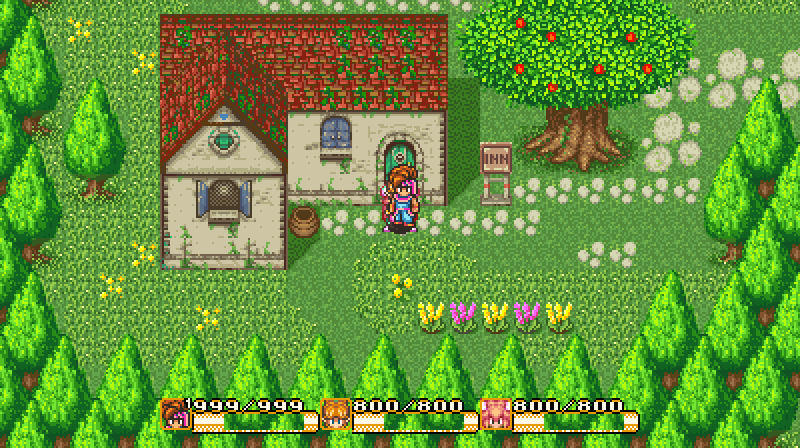
</p>

## Before / after

<table>
  <tr><th>Original (4:3)</th><th>Widescreen (16:9)</th></tr>
  <tr>
    <td width="39%">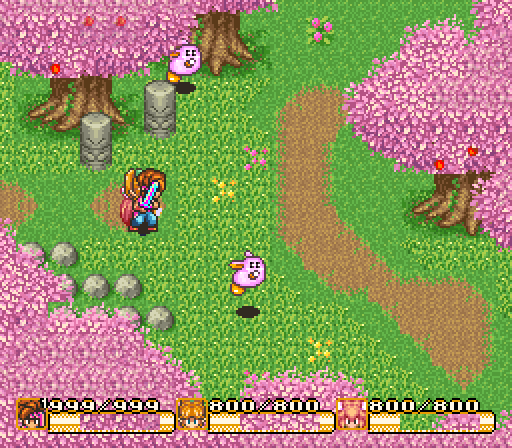</td>
    <td width="61%">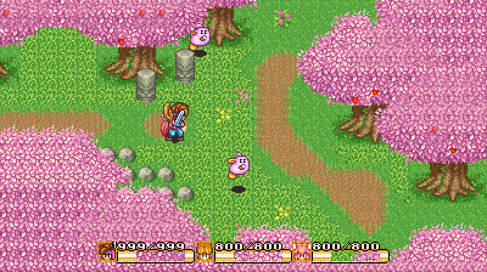</td>
  </tr>
  <tr>
    <td>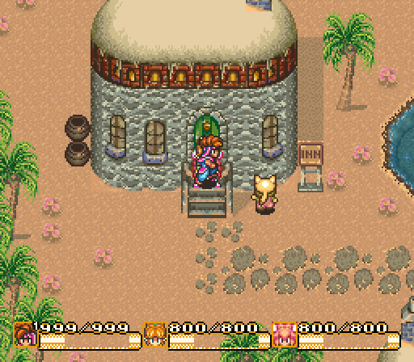</td>
    <td>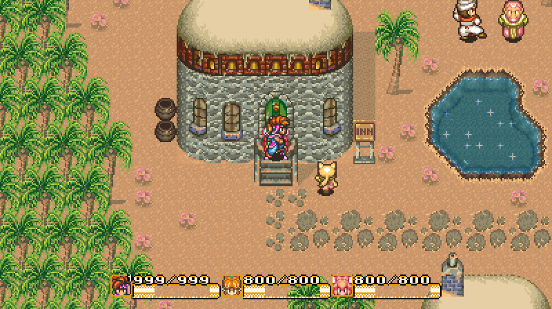</td>
  </tr>
  <tr>
    <td>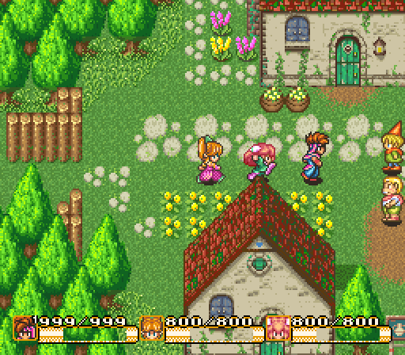</td>
    <td>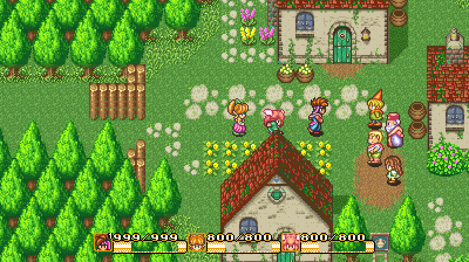</td>
  </tr>
  <tr>
    <td>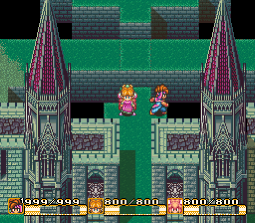</td>
    <td>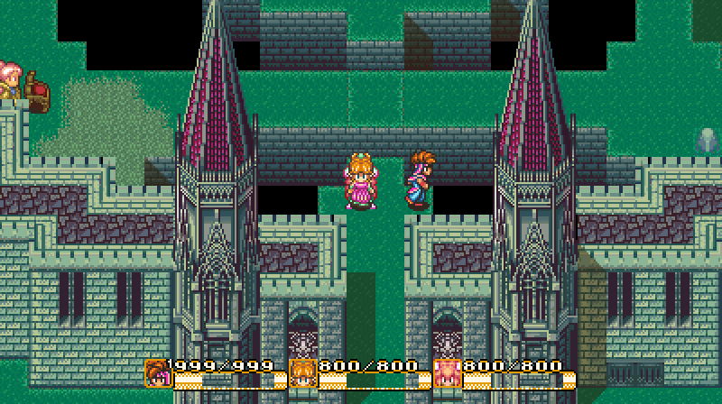</td>
  </tr>
  <tr>
    <td>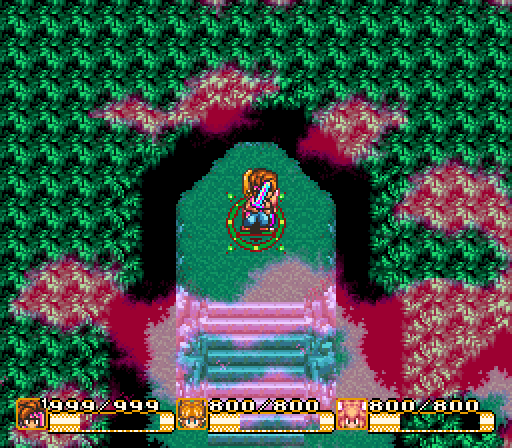</td>
    <td>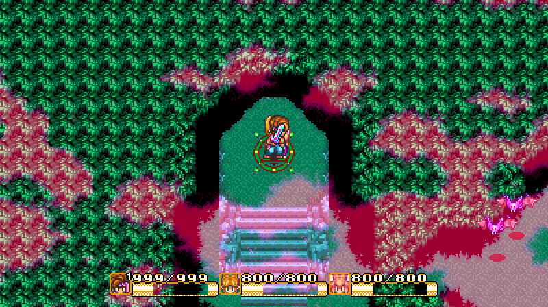</td>
  </tr>
  <tr>
    <td>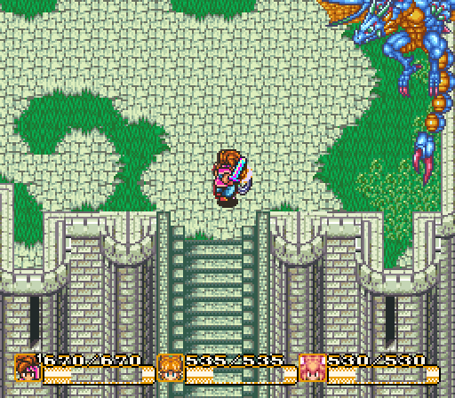</td>
    <td>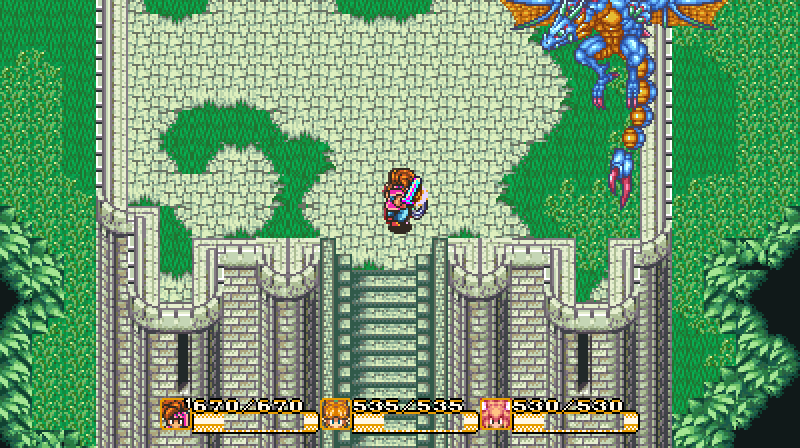</td>
  </tr>
</table>

## More screenshots

<p align="center">
  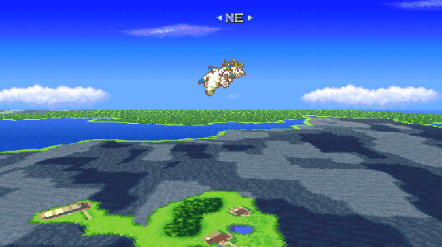
</p>

| | |
|---|---|
| 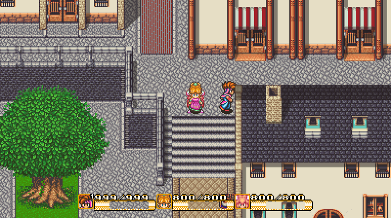 | 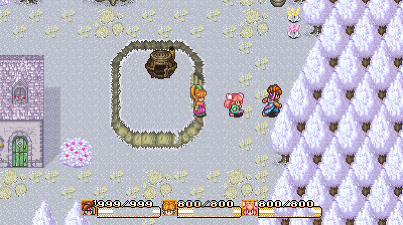 |
| 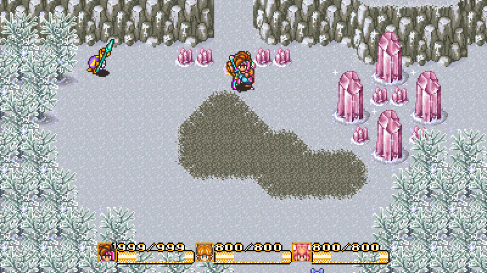 | 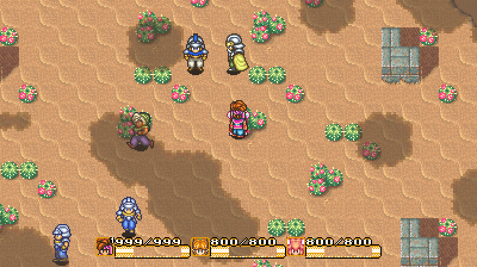 |
| 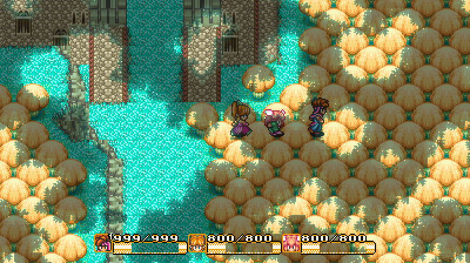 | 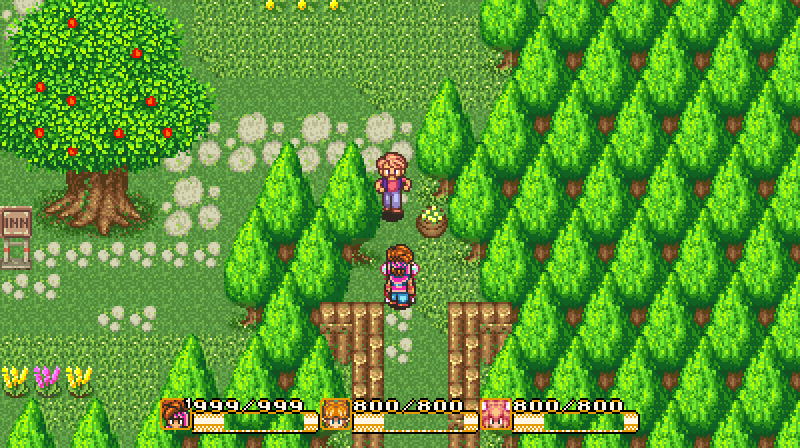 |

## Installing

You need:

- **bsnes-hd beta 10.6** (standalone, or the *bsnes-hd beta* libretro core in RetroArch)
- An unheadered **Secret of Mana (USA)** ROM
  SHA-1 `8133041A363E3CC68CEDEF40B49B6D20D03C505D`

Then:

1. Download the zip from the [latest release](../../releases/latest) (or grab both files from the [`patch`](patch) folder). It contains `Secret of Mana (USA).bps` and `Secret of Mana (USA).bso`.
2. Put both files next to your ROM, named the same as the ROM. If your ROM is `Secret of Mana.sfc` or `Secret of Mana.zip`, rename them to `Secret of Mana.bps` and `Secret of Mana.bso`.
3. Load the ROM in bsnes-hd.

That's it. bsnes-hd soft-patches the ROM with the `.bps`, and the `.bso` turns on widescreen at 16:9, lets sprites into the side areas, and keeps the HUD, ring menus and text boxes at 4:3. You don't need to change any emulator settings.

If you'd rather hard-patch, apply the `.bps` with [Flips](https://github.com/Alcaro/Flips) and keep the `.bso` next to the patched ROM (renamed to match).

Your existing `.srm` save files work as normal. Don't load save states made with the unpatched game.

## What it changes

- **Backgrounds:** map rows are rebuilt across the whole 512 px tilemap, and columns stream 80 px further out on each side, so both background layers are correct in the side areas. Drifting overlays like the Haunted Forest mist and the desert cloud shadows extend too.
- **Small rooms:** rooms narrower than the 16:9 view get a centred, horizontally locked camera, so you see the whole room instead of the far side of the map wrapping around.
- **Sprites:** characters, NPCs, enemies, shadows and spell effects are drawn in the side areas. Enemies aren't treated as off-screen while they're still visible.
- **Bosses:** bosses drawn on a background layer (the dragons, for example) show and hide properly at 16:9.
- **Flammie:** the Mode 7 flight scenes stream the sky panorama wider, including right after take-off.
- **UI:** the HUD, ring menus, text boxes and status screens stay centred at 4:3.

It costs about 2% extra CPU on the busiest maps, which isn't noticeable in play.

## Known limitations

- **16:9 only.** Wider ratios (21:9, 2:1) would show areas the game doesn't draw, so the `.bso` forces 16:9.
- **Neighbouring rooms:** some maps pack several rooms side by side, so you can sometimes see a sliver of the next room at the edge. It's real map data that 4:3 never reached.
- **Hi-res menus:** the file select, weapon/magic level and naming screens keep their 4:3 boxes, and bsnes-hd only partly extends their scrolling background.
- **Large BG bosses** can disappear a little early (up to ~40 px) inside the side area. Otherwise a wrapped copy would appear on the opposite side.

Testing covered every map entrance (397 maps), checked tile by tile, plus 21 save files' worth of menus, the intro, Flammie flight and 44 boss arenas. Some story cutscenes move the camera in unusual ways and weren't all watched individually. If something looks off, please open an issue with a screenshot and where it happened.

## Changelog

**v1.1**
- Fixed a soft lock during the cannon travel cutscenes.
- Knocked-out party members and other multi-part sprites no longer vanish in the side areas.
- The log in the intro scene now stretches across the full width.
- Enemy despawn and off-screen behaviour is back to the original game's.

**v1.0**
- First release.

## Building from source

The patch is written for [asar](https://github.com/RPGHacker/asar) 1.90 or later.

```
python src/build.py "Secret of Mana (USA).sfc" --asar path/to/asar --flips path/to/flips
```

This writes a patched ROM and a fresh `.bps` to `src/`. The output is byte-identical to the release patch.

## Credits

- [bsnes-hd](https://github.com/DerKoun/bsnes-hd) by DerKoun, built on bsnes by Near
- [asar](https://github.com/RPGHacker/asar) and [Flips](https://github.com/Alcaro/Flips)
- Test save files from [FantasyAnime](https://fantasyanime.com/mana/somsaves.htm)

Secret of Mana is © Square Enix. This repository contains no ROM data, only the patch and its source.
